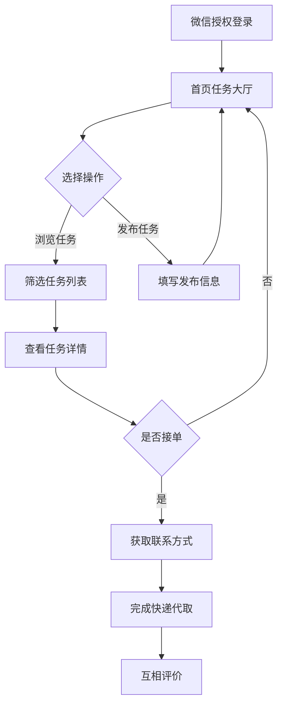

## 1. 产品概述
基于微信小程序的校园快递代取互助平台，为合肥工业大学宣城校区学生提供快递代取服务。学生可通过微信一键登录发布代取任务或接单，解决校园内快递领取不便的问题，促进同学间的互助合作。

## 2. 核心功能

### 2.1 用户角色
| 角色 | 注册方式 | 核心权限 |
|------|----------|----------|
| 普通用户 | 微信授权登录 | 发布代取任务、接单、查看联系方式、评价 |
| 管理员 | 后台分配账号 | 审核用户、处理投诉、统计订单、管理公告 |

### 2.2 功能模块
小程序主要包含以下核心页面：
1. **首页**：任务大厅、筛选功能、发布入口
2. **发布页**：填写快递信息、联系方式、酬劳
3. **任务详情页**：任务信息、接单按钮、联系方式
4. **我的页面**：我的发布、我的接单、个人信息、评价管理
5. **后台管理页**：用户审核、投诉处理、数据统计

### 2.3 页面详情
| 页面名称 | 模块名称 | 功能描述 |
|----------|----------|----------|
| 首页 | 任务大厅 | 展示所有待接单任务，显示快递点、酬劳、发布时间 |
| 首页 | 筛选功能 | 按南区/北区快递点、时间排序、酬劳范围筛选任务 |
| 首页 | 发布入口 | 快速跳转至发布页面的按钮 |
| 发布页 | 快递信息填写 | 选择南区/北区快递点、输入取件码、快递公司 |
| 发布页 | 联系方式填写 | 填写联系电话、微信号（选填） |
| 发布页 | 酬劳设置 | 设置代取酬劳金额（0-50元） |
| 发布页 | 备注信息 | 添加特殊要求或说明 |
| 任务详情页 | 任务信息展示 | 显示完整的快递信息、联系方式、酬劳 |
| 任务详情页 | 接单功能 | 点击接单按钮，确认接单 |
| 任务详情页 | 联系方式 | 接单后显示发布者电话和微信 |
| 我的页面 | 我的发布 | 查看自己发布的任务状态（待接单/已接单/已完成） |
| 我的页面 | 我的接单 | 查看自己接取的任务 |
| 我的页面 | 个人信息 | 显示昵称、联系方式、信誉评分 |
| 我的页面 | 评价管理 | 查看收到的评价和给他人评价 |
| 后台管理页 | 用户审核 | 查看注册用户，处理异常账号 |
| 后台管理页 | 投诉处理 | 查看处理用户投诉举报 |
| 后台管理页 | 数据统计 | 查看订单量、活跃用户等统计数据 |

## 3. 核心流程

### 用户流程
1. 用户通过微信授权登录小程序
2. 浏览首页任务大厅，可按条件筛选任务
3. 点击发布按钮，填写快递信息、联系方式、酬劳等发布任务
4. 其他用户浏览任务，选择合适的任务接单
5. 接单后双方可查看联系方式，通过电话或微信沟通具体取件事宜
6. 快递交付完成后，双方可互相评价

### 管理员流程
1. 管理员通过后台账号登录管理系统
2. 审核新注册用户，处理异常账号
3. 查看处理用户投诉举报
4. 查看平台运营数据统计

## 4. 用户界面设计

### 4.1 设计风格
- **主色调**：校园蓝（#1890FF）配白色背景
- **辅助色**：绿色（#52C41A）表示成功状态，橙色（#FA8C16）表示警告
- **按钮样式**：圆角矩形，主要操作用主色调填充
- **字体**：微信小程序默认字体，标题18px，正文14px
- **布局风格**：卡片式布局，清晰的信息层级
- **图标风格**：使用微信小程序标准图标库

### 4.2 页面设计概述
| 页面名称 | 模块名称 | UI元素 |
|----------|----------|--------|
| 首页 | 任务大厅 | 顶部搜索栏，任务卡片列表，每个卡片显示快递点、酬劳、发布时间，底部发布按钮 |
| 发布页 | 信息填写 | 表单式布局，快递点选择器（南区/北区），输入框组，酬劳滑块，发布按钮 |
| 任务详情页 | 详情展示 | 信息分组展示，顶部任务状态标签，中部详细信息，底部操作按钮 |
| 我的页面 | 个人中心 | 顶部个人信息卡片，中部功能入口网格，底部退出登录按钮 |

### 4.3 响应式设计
采用微信小程序原生适配方案，支持不同尺寸手机屏幕，确保在各种设备上都有良好的用户体验。主要考虑触摸交互优化，按钮大小适合手指点击。