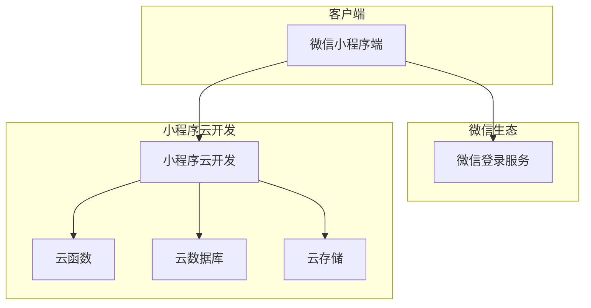
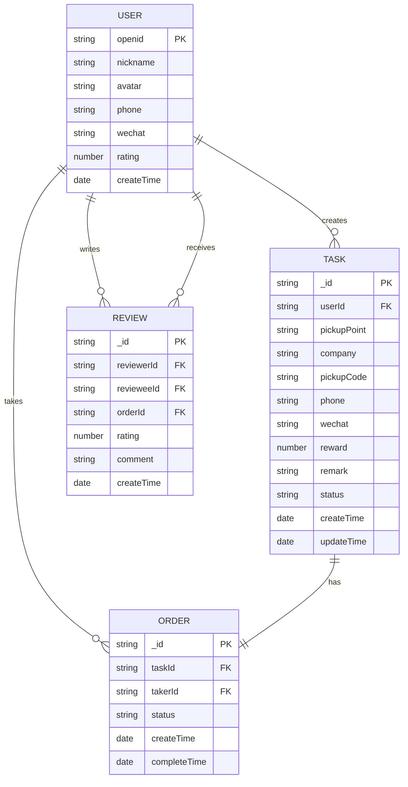

## 1. 架构设计



## 2. 技术描述

- **前端**：微信小程序原生开发
- **后端**：小程序云开发（云函数、云数据库、云存储）
- **认证**：微信官方登录接口
- **数据库**：小程序云开发数据库（类MongoDB）
- **文件存储**：小程序云存储

## 3. 页面路由定义

| 页面路径 | 用途 |
|---------|------|
| /pages/index/index | 首页任务大厅 |
| /pages/publish/publish | 发布任务页面 |
| /pages/detail/detail | 任务详情页面 |
| /pages/profile/profile | 个人中心页面 |
| /pages/my-tasks/my-tasks | 我的发布页面 |
| /pages/my-orders/my-orders | 我的接单页面 |
| /pages/admin/admin | 后台管理页面 |

## 4. 数据模型设计

### 4.1 数据模型定义



### 4.2 数据库表结构设计

**用户表（users）**
```json
{
  "_id": "string",
  "_openid": "string",
  "nickname": "string",
  "avatar": "string",
  "phone": "string",
  "wechat": "string",
  "rating": "number",
  "createTime": "date"
}
```

**任务表（tasks）**
```json
{
  "_id": "string",
  "userId": "string",
  "pickupPoint": "string", // 南区/北区
  "company": "string", // 快递公司
  "pickupCode": "string",
  "phone": "string",
  "wechat": "string",
  "reward": "number",
  "remark": "string",
  "status": "string", // pending/accepted/completed
  "createTime": "date",
  "updateTime": "date"
}
```

**订单表（orders）**
```json
{
  "_id": "string",
  "taskId": "string",
  "takerId": "string",
  "status": "string", // accepted/completed
  "createTime": "date",
  "completeTime": "date"
}
```

**评价表（reviews）**
```json
{
  "_id": "string",
  "reviewerId": "string",
  "revieweeId": "string",
  "orderId": "string",
  "rating": "number",
  "comment": "string",
  "createTime": "date"
}
```

## 5. 云函数设计

### 5.1 核心云函数

**用户相关**
- `login`: 微信登录，获取用户信息
- `updateUserInfo`: 更新用户联系方式

**任务相关**
- `createTask`: 创建代取任务
- `getTaskList`: 获取任务列表（支持筛选）
- `getTaskDetail`: 获取任务详情
- `acceptTask`: 接单功能

**订单相关**
- `completeOrder`: 完成订单
- `getMyTasks`: 获取我的发布
- `getMyOrders`: 获取我的接单

**评价相关**
- `createReview`: 创建评价
- `getUserReviews`: 获取用户评价

**管理相关**
- `getUserList`: 获取用户列表（管理员）
- `updateUserStatus`: 更新用户状态
- `getStatistics`: 获取统计数据

### 5.2 安全规则配置

**数据库权限规则**
```javascript
// 用户表权限
{
  "read": true,
  "write": "auth.openid == resource.openid"
}

// 任务表权限
{
  "read": true,
  "create": true,
  "update": "doc.userId == auth.openid || doc.takerId == auth.openid",
  "delete": "doc.userId == auth.openid"
}

// 订单表权限
{
  "read": "doc.takerId == auth.openid || doc.userId == auth.openid",
  "create": true,
  "update": "doc.takerId == auth.openid || doc.userId == auth.openid"
}
```

## 6. 部署配置

### 6.1 小程序配置
- appid: 微信小程序AppID
- 云开发环境ID: 需要在微信开发者工具中开通

### 6.2 云开发环境配置
- 数据库：自动创建集合
- 存储：用于用户头像等文件存储
- 云函数：部署所有后端逻辑函数